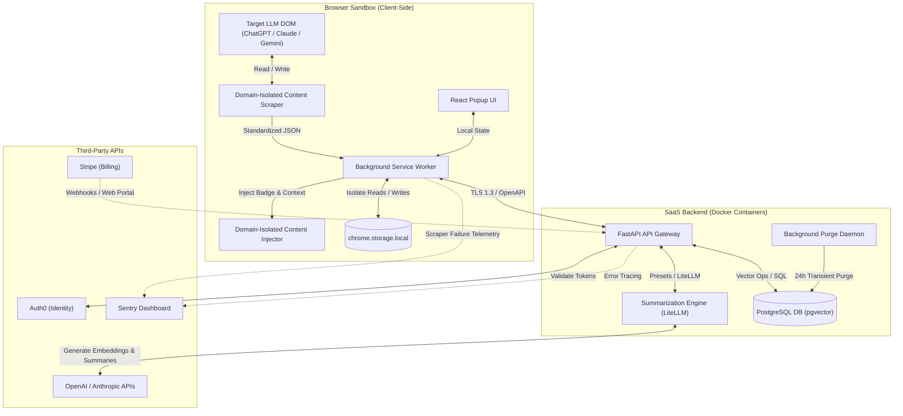
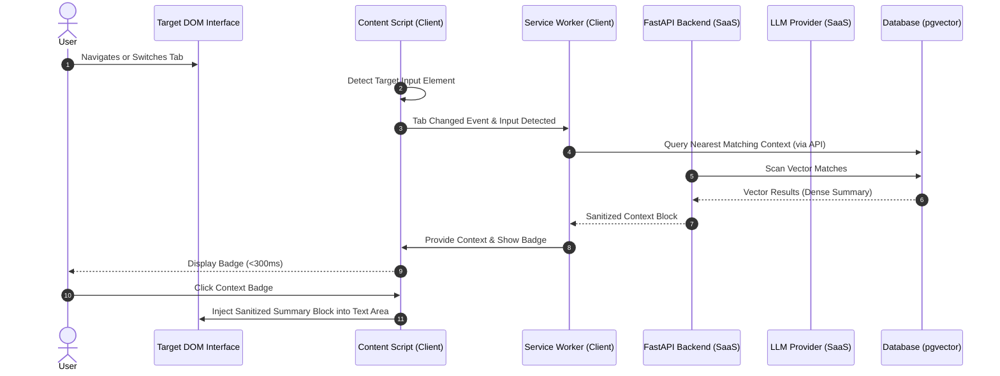
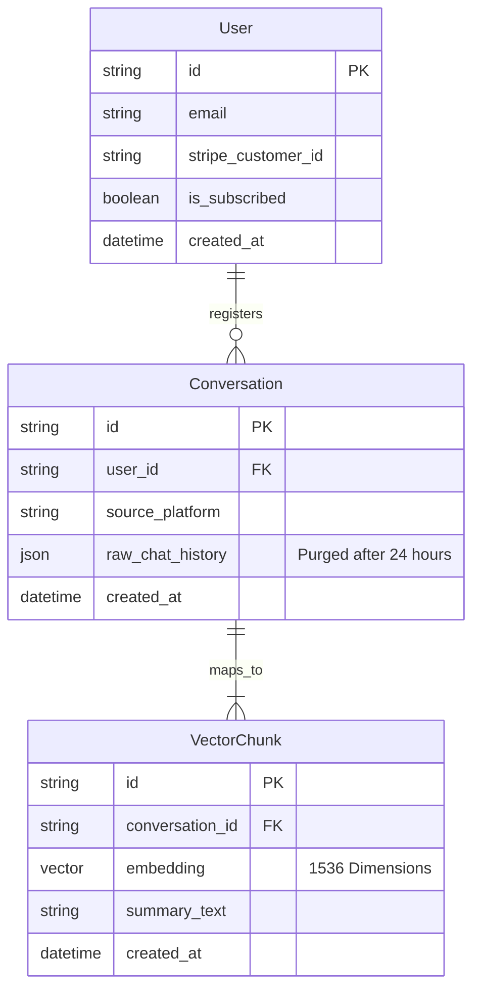

# System Solution: SharedMemory AI

## Overview

### Description
SharedMemory AI is a cross-browser extension and supporting SaaS platform designed to eliminate context fragmentation for multi-LLM users. When users switch between popular AI interfaces (such as ChatGPT, Claude, Gemini, or local models) due to credit depletion, the platform automatically retrieves, sanitizes, summarizes, and injects their chat histories. This ensures a frictionless transition without requiring users to repeat context manually.

The system is designed around a hub-and-spoke multi-agent architecture. The browser extension acts as an edge-based, domain-isolated client, scraping and injecting DOM structures locally. The FastAPI backend acts as a high-throughput synchronization engine that processes sensitive user information, manages relational metadata, interacts with third-party LLM providers via LiteLLM to generate summaries, and performs fast vector semantic searches using PostgreSQL with the `pgvector` extension.

This solution fully addresses Functional Requirements FR-001 through FR-007, and guarantees the rigorous latency, isolation, and coverage constraints detailed in NFR-001 through NFR-005.

### Technology Stack
| Component | Technology | Rationale |
|-----------|------------|-----------|
| Extension Runtime | TypeScript, React, Vite | Enforces strict compile-time safety and high performance for UI rendering within chrome sandboxes. |
| Backend Framework | Python 3.11, FastAPI | Lightweight, high-concurrency async web framework compliant with OpenAPI standards. |
| Database / Vector | PostgreSQL + pgvector | Combines relational metadata storage and low-latency semantic indexing within a single transactional engine. |
| LLM Orchestration | LiteLLM | Unified translation layer supporting OpenAI and Anthropic SDKs with built-in fallback and model configurations. |
| Embeddings Model | OpenAI text-embedding-3-small | Highly performant 1536-dimensional embeddings with low request overhead. |
| Auth & Billing | Auth0 + Stripe Webhooks | Secure SaaS standard identity provider integrated with automated billing cycles. |
| Observability | Sentry (Browser & Backend) | Collects execution traces and live DOM parsing exceptions from the client. |
| Testing Framework | Playwright & Pytest | Automated browser-level integration testing and unit testing coverage engines. |

### Design Decisions Summary
| Decision | Choice | Rationale |
|----------|--------|-----------|
| Auth Integration | Auth0 with Stripe Webhooks | Offloads identity, token lifecycle, and billing workflows to reliable third-party SaaS engines. |
| LLM Orchestration | LiteLLM | Simplifies multi-provider routing and fallbacks between OpenAI and Anthropic APIs. |
| Scraper Alerting | Hybrid GHA Tests + Sentry | Playwright checks DOM interfaces every 6h, while live user telemetry sends exception reports to Sentry. |
| Vector Indexing | OpenAI API Embeddings | Eliminates the operational footprint and hardware cost of hosting local sentence-transformers. |
| Client Storage | `chrome.storage.local` | Strict sandbox execution isolated from third-party client DOM memory execution spaces. |

## High-Level Architecture Design

### Architecture Description
- **Domain-Isolated Content Scripts**: Scraper and Injector scripts run in isolated contexts, executing pure-function DOM parsers matching specific target platforms (ChatGPT, Claude, Gemini, or Localhost).
- **Extension Background Service Worker**: Coordinates local data workflows, reads/writes to secure `chrome.storage.local`, intercepts tab events, and dispatches API sync packets.
- **FastAPI API Gateway**: Decodes and validates Auth0 JWTs, validates schema contracts, and routes requests to the business logic handlers.
- **Summarization & Embedding Hub**: Interacts with OpenAI and Anthropic APIs through the LiteLLM library, managing instruction-preset prompts.
- **PostgreSQL Database**: Persists transaction logs and metadata. Vector representations are queried using cosine similarity inside pgvector.
- **Background Purge Daemon**: Periodically purges raw conversation structures older than 24 hours to comply with strict transient data constraints.

### Architecture Diagram


### Module Interactions


## System Modules

### Module 1: Extension Client (Scraper & Injector)

**Responsibilities:**
- Execute isolated scripts mapped directly to ChatGPT, Claude, Gemini, and Localhost patterns.
- Perform DOM extraction of raw text streams using pure functions.
- Enforce client-side blocklists, keywords, and regular expression PII scrubbing prior to caching or transit.
- Capture active tab-change listeners within 300 milliseconds.
- Display an interactive overlay badge and inject sanitized summaries into prompt input textareas.

**Key Interfaces:**
```text
interface ContentScraper {
  parseDOM(fragment: DocumentFragment): RawMessagePayload;
  sanitizePayload(payload: RawMessagePayload, regexList: RegExp[], blocklist: string[]): SanitizedMessagePayload;
}

interface ContentInjector {
  detectInputTextArea(document: Document): Promise<HTMLTextAreaElement | null>;
  renderOverlayBadge(target: HTMLTextAreaElement, contextAvailable: boolean): void;
  injectContext(target: HTMLTextAreaElement, context: string): void;
}
```

**Data Models:**
```text
type MessageRole = "user" | "assistant" | "system";

type Message = {
  role: MessageRole;
  text: string;
  timestamp: string;
};

type SanitizedMessagePayload = {
  sourcePlatform: "chatgpt" | "claude" | "gemini" | "local";
  messages: Message[];
  checksum: string;
};
```

**Dependencies:**
- `chrome.storage.local` (Local sandbox database)
- Sentry Browser SDK

**Error Handling:**
- DOM selector mismatched (UI structure changed): Suppress extension UI alerts from end users. Cache the parser exception state locally, format diagnostic telemetry (including structural DOM hints), and push to Sentry.

### Module 1B: Extension Popup UI & Clipboard Utility

**Responsibilities:**
- Provide an interactive popup interface built with React to allow manual user triggers, configurations of blocklists, and copy/paste features.
- Convert active sanitized message lists into formatted Markdown or JSON format strings and write them directly to the system clipboard for manual migration.
- Parse manually pasted JSON or Markdown context strings, validate them against system schemas, and hydrate active memory payloads.

**Key Interfaces:**
```text
interface ClipboardUtility {
  exportToClipboard(payload: SanitizedMessagePayload, format: 'markdown' | 'json'): void;
  importFromClipboard(text: string): SanitizedMessagePayload;
}
```

**Data Models:**
- Leverages the `SanitizedMessagePayload` schema defined in Module 1.

**Dependencies:**
- Browser `navigator.clipboard` API
- React popup state manager
- `chrome.storage.local` sandbox

**Error Handling:**
- Clipboard write/read permissions denied: Show an intuitive, non-obtrusive warning status bar in the popup UI.
- Malformed or invalid pasted structure: Apply validation schema passes, detect formatting violations (e.g. missing timestamps, malformed JSON, schema version mismatch), and display friendly, actionable validation text in the UI instead of failing silently or throwing uncaught runtime exceptions.

### Module 2: SaaS Backend API Service

**Responsibilities:**
- Secure authentication edge verifying Auth0 JWT signatures.
- Enforce paid user restrictions by mapping token context claims to active Stripe subscription records.
- Interface with LiteLLM to dispatch summaries dynamically utilizing custom instructional templates (Presets).
- Generate embeddings vectors from context text blobs.

**Key Interfaces:**
```text
interface AuthValidator {
  verifyJWT(token: string): AuthTokenClaims;
  checkSubscriptionStatus(userId: string): Promise<boolean>;
}

interface PromptSummarizer {
  generateSummary(payload: SanitizedMessagePayload, preset: string): Promise<string>;
  generateEmbeddings(text: string): Promise<number[]>;
}
```

**Dependencies:**
- `LiteLLM` (Multi-LLM abstract SDK)
- `Auth0 Python SDK`
- `Stripe SDK`

**Error Handling:**
- LiteLLM Timeout / Service Outage: Trigger fallback to deterministic structural truncation heuristics (combining last 3 dialogue turns into raw summary text) and emit a warning log trace.

### Module 3: Vector Memory & Database Service

**Responsibilities:**
- Manage transactional PostgreSQL relationships.
- Generate multi-dimensional indexes using the pgvector extension.
- Handle low-latency cosine distance semantic searches to hydrate historical context sessions.
- Run cron daemons that clean up raw text records exceeding the 24-hour retention constraint.

**Data Models:**
```text
type UserRecord = {
  id: string; // Auth0 UUID mapping
  stripeCustomerId: string;
  isSubscribed: boolean;
  createdAt: string;
};

type ContextChunk = {
  id: string;
  userId: string;
  embedding: float[]; // 1536 size
  summaryText: string;
  createdAt: string;
};
```

**Dependencies:**
- PostgreSQL Engine (with `pgvector` loaded)
- `SQLAlchemy` (Python ORM)

**Error Handling:**
- Database Query Overload / Thread Pool Exhaustion: Implement exponential backoff inside FastAPI ORM connections and reject incoming synchronization operations gracefully with HTTP 429 status.

## Data Model

### Entity-Relationship Diagram


### Entities
- **User** — Manages identity mapping, core profiles, and billing statuses.
  - Fields: `id` (VARCHAR(255), PK, maps to Auth0 identifier), `email` (VARCHAR(255)), `stripe_customer_id` (VARCHAR(255), Unique), `is_subscribed` (BOOLEAN, default False), `created_at` (TIMESTAMP).
- **Conversation** — Captures transient interactions. Raw data is strictly expunged periodically.
  - Fields: `id` (UUID, PK), `user_id` (VARCHAR(255), FK referencing User.id), `source_platform` (VARCHAR(50)), `raw_chat_history` (JSONB, nullable), `created_at` (TIMESTAMP).
  - Constraints/Indexes: B-Tree index on `user_id` and `created_at`.
- **VectorChunk** — Long-term semantic summary indices used for platform synchronization.
  - Fields: `id` (UUID, PK), `conversation_id` (UUID, FK referencing Conversation.id, ON DELETE CASCADE), `embedding` (VECTOR(1536)), `summary_text` (TEXT), `created_at` (TIMESTAMP).
  - Indexes: HNSW vector index using cosine operator (`vector_cosine_ops`) for speed optimization.

## API / Protocol Design

### REST Endpoints
| Method | Path | Description | Auth |
|--------|------|-------------|------|
| POST | `/api/v1/sync` | Sync parsed conversation data, generate vector, return immediate context summary. | Auth0 JWT (Paid Stripe customers only) |
| GET | `/api/v1/context` | Perform semantic lookup of matched historical blocks to hydrate target platforms. | Auth0 JWT (Paid Stripe customers only) |
| POST | `/api/v1/telemetry/scraper-error` | Accept DOM parsing error structural payloads to power proactive alert pipelines. | Optional |
| POST | `/api/v1/stripe/webhook` | Process Stripe billing updates (subscription changes, cancellations). | Stripe Signature Check |

### Message Schemas

```text
type SyncRequestPayload = {
  sourcePlatform: string;
  messages: Array<{
    role: string;
    text: string;
    timestamp: string;
  }>;
};

type SyncResponsePayload = {
  conversationId: string;
  summaryText: string;
  presetApplied: string;
};

type MatchContextResponse = {
  matches: Array<{
    chunkId: string;
    summaryText: string;
    similarityScore: float;
  }>;
};

type TelemetryErrorPayload = {
  platform: string;
  targetURL: string;
  errorLog: string;
  domStructureSnippet: string;
};
```

## Security Architecture

### Authentication & Authorization
- **Token Checks**: All client requests must transit Auth0 JWTs signed via the RS256 algorithm. The API Gateway decodes claims, verifies signatures against Auth0's JWKS, and evaluates `is_subscribed` flags prior to downstream business logic processing.
- **Tenant Isolation**: Row-Level Security policies (RLS) or programmatic SQL filters ensure queries to vector resources implicitly match the authenticated User ID.

### Input Validation
- **JSON Contracts**: Strict schema enforcement is handled via FastAPI's integration with Pydantic. Payload properties that violate defined properties or boundaries trigger instant validation failure exceptions (HTTP 422).
- **Client-Side Regex Scrubbing**: Regular expression sequences actively block credit cards, API secrets (`sk-...`, `AIzaSy...`), and PII variables in the browser before transfer, preventing exposure of sensitive data.
- **Sanitization Engine**: Context blocks destined for target text inputs are escaped to prevent prompt-injection hacks from hijacking down-stream models.

### Data Protection
- **Secrets Management**: Access tokens (Auth0 client keys, Stripe signing endpoints, OpenAI/Anthropic keys) are stored in secure environment parameters processed using runtime environments and never saved within repositories.
- **Encryption at rest / in transit**: Relational data databases utilize AES-256 block encryption. All HTTP interactions enforce TLS 1.3 encryption.
- **Transient Lifetime Lifecycle**: Raw dialog parameters captured within the client must be systematically deleted 24 hours after synchronization via the DB cron daemon.

## Deployment & Operations

### Infrastructure Layout
- **Runtime Nodes**: Backend FastAPI applications run as containerized instances managed in Amazon ECS (Fargate) or GCP Cloud Run.
- **Database Subnet**: PostgreSQL with `pgvector` runs inside AWS RDS PostgreSQL, configured within private subnets isolated from external HTTP exposure.
- **Local Hostport Gateway**: Port mappings in the extension configuration allow the scraper script to safely check `127.0.0.1` and `localhost` ports to parse local instances (e.g. Ollama, LM Studio) without breaking browser security policies.

### Scaling Strategy
- **Horizontal Pod Autoscaling (HPA)**: Scaled dynamically based on CPU/Memory utilization thresholds (e.g., target 70% CPU usage).
- **Connection Multiplexing**: PgBouncer manages database connection pooling, minimizing the connection footprint during peak concurrent traffic.
- **Model Call Caching**: Redis acts as an ephemeral caching layer to store recurring summarization operations and reduce API invocation costs.
  - **Cache Key Schema**: The Redis cache key is constructed as `summary:cache:[SHA256_HASH_OF_CONVERSATION_MESSAGES]:[PRESET_STYLE]`. This ensures identical conversations summarized with the same preset bypass duplicate model invocations.
  - **Eviction Policy**: Configured with a `volatile-lru` (Least Recently Used) eviction policy and a 2-hour Time-to-Live (TTL), matching standard short-lived active browser session patterns.
  - **Offline and API Disconnect Graceful Fallback**: If the Redis cache or backend APIs are completely offline (e.g., connection timeouts, network disconnects), the browser extension's content scripts and background service worker fall back gracefully to reading and writing directly to `chrome.storage.local`. In this offline fallback state, the user is notified via the interactive overlay badge, and manual export/import features (as defined in Module 1B) remain fully operational using local sandboxed state.

### Configuration
| Variable | Required | Default | Description |
|----------|----------|---------|-------------|
| `DATABASE_URL` | Yes | N/A | PostgreSQL connection string. |
| `AUTH0_DOMAIN` | Yes | N/A | Auth0 tenant domain used for JWKS token verification. |
| `STRIPE_WEBHOOK_SECRET` | Yes | N/A | Signing key used to validate incoming Stripe webhook payloads. |
| `OPENAI_API_KEY` | Yes | N/A | API credentials for generating summaries and embedding vectors. |
| `ANTHROPIC_API_KEY` | Yes | N/A | API credentials for Anthropic model presets. |
| `SENTRY_DSN` | No | None | Endpoint for error collection and DOM exception reporting. |

## Observability

### Correlation / Tracing
- **Context Identifiers**: The client generates a unique `x-request-id` header for every tab transition and context extraction session. This correlation identifier propagates through FastAPI logs and external API integration hooks.

### Structured Logging
- **Log Structures**: Backend processes output logs in structured JSON format to stdout.
- **Execution Severity Levels**:
  - `DEBUG`: Standard operations tracing (e.g. database connections, tab detection).
  - `INFO`: Business milestones (e.g. users authenticated, context blocks compiled).
  - `WARN`: Resilience events (e.g. LLM timeouts, database retry conditions).
  - `ERROR`: System faults requiring attention (e.g. DOM structural changes on target platforms, database lockups).

## Testing Strategy

### E2E / Smoke Test Execution
- Playwright processes run on 6-hour cron pipelines via GitHub Actions, validating scrapers against active DOM structures on live target portals (`chatgpt.com`, `claude.ai`, `gemini.google.com`).
- On script execution failure, the workflow executes a notification payload containing selector errors and raw DOM schema captures, sending immediate alerts to developers via Slack and email.

### Unit / Integration Testing
- Python backend tests are executed using Pytest, asserting mock LiteLLM integrations, embedding indexing, token validations, and cleanup tasks.
- Target codebases must strictly enforce a minimum **80% automated test coverage threshold** verified within the CI pipeline.

## Success Criteria

| Criterion | Target | Measurement |
|-----------|--------|-------------|
| Zero-Lag Tab Injection | < 300ms | Performance duration tracker in content script measuring tab change events to DOM injection ready state. |
| Summarization Latency | < 1.5 seconds | Time-to-response duration monitored at the backend gateway during context compile requests. |
| Code Coverage Target | >= 80% coverage | Calculated dynamically in the CI pipeline using Pytest-cov and Instanbul during test runner stages. |
| Interface Alert Accuracy | 100% alert accuracy | GHA Cron script failures trigger developer alert dispatches within 15 minutes of occurrence. |
| Client Sanitization Leakage | 0 instances | Scraped history files inspected via automated validation passes to ensure zero API keys or credentials leak beyond client boundaries. |

## Key Solution Decisions

| Decision | Rationale | Alternatives Considered |
|----------|-----------|------------------------|
| **Auth0 + Stripe Integration** | Drastically reduces time-to-market. Leverage production-tested standards for subscription management, token structures, and security checks. | Creating a custom self-hosted OAuth mechanism with raw PostgreSQL user tables. Rejected due to increased engineering overhead and security liability. |
| **LiteLLM Orchestration** | Provides instant cross-provider capabilities (OpenAI and Anthropic) with simple fallback routines, allowing seamless API transition if a provider is down. | Direct integration of individual provider Python SDKs. Rejected to avoid dependency bloat and complex manual routing code. |
| **Hybrid Alerting (Playwright + Sentry)** | Combines scheduled validation runs to catch system changes early with real-time browser tracing to capture localized DOM mutations. | Relying solely on manual error reporting or live client reporting. Rejected because silent selector failures degrade the user experience without notifying developers. |
| **OpenAI text-embedding-3-small** | Generates stable vector records with minimal pricing footprints and high performance, requiring zero local hosting infrastructure. | Running sentence-transformers inside sidecar containers. Rejected due to high RAM/GPU requirements and increased server orchestration costs. |