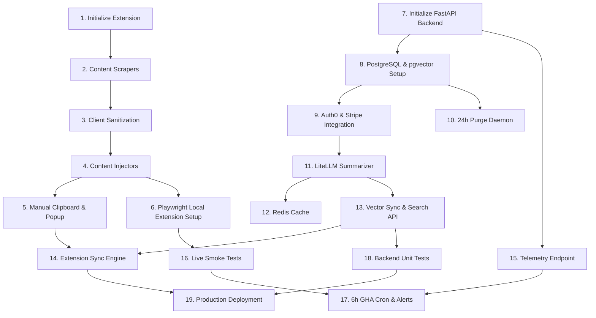

# Implementation Tasks: SharedMemory AI

## Overview
This task list outlines a structured implementation strategy to build the SharedMemory AI platform. Following the Extension-First path with immediate Playwright E2E integration, development begins with building local-first browser capabilities (scrapers, injectors, and offline manual backup structures) in Milestone 1, followed by backend SaaS infrastructure (Dockerized FastAPI, pgvector, and auth) in Milestone 2. Milestone 3 implements active LLM-powered summarization, vector database indexing, and browser client synchronization. Milestone 4 focuses on automated testing pipelines (with a 6-hour cron engine to catch target DOM updates), code coverage enforcement, and production deployment preparation.

Total tasks: 19

---

## Milestone 1: Project Setup & Extension Core (Local Offline Capability)

- [ ] 1\. Initialize Browser Extension & Sandboxed Storage
  - Create a Vite-based browser extension template configured for React, TypeScript, and Tailwind CSS.
  - Configure `tsconfig.json` with `strict: true` and disallow implicit `any` definitions.
  - Structure `manifest.json` under Manifest V3 specifications, requesting host permissions for `chatgpt.com`, `claude.ai`, `gemini.google.com`, and localhost port schemes.
  - Setup background scripts, popup configurations, and the `chrome.storage.local` environment.
  - Acceptance Criteria:
    - Extension compiles with zero TypeScript compiler errors or warnings under strict settings.
    - Extension popup renders and correctly reads/writes arbitrary test values to and from isolated `chrome.storage.local`.
  - _Dependencies: none_
  - _Requirements: NFR-004_
  - _Complexity: Medium_

- [ ] 2\. Create Domain-Isolated Content Scraper Modules
  - Author isolated content scraper scripts targeting `chatgpt.com`, `claude.ai`, `gemini.google.com`, and localhost ports.
  - Implement pure, side-effect-free DOM parsing functions using standard query selectors for each target domain to retrieve user and assistant dialogue exchanges.
  - Construct a MutationObserver framework in content scripts that listens for active chat thread updates and parses document fragments on-the-fly.
  - Enforce schema validation converting parsed outputs into structured JSON containing timestamps, author roles, and text.
  - Handle parsing mismatch failures gracefully by catching errors, saving structural clues locally, and preparing diagnostic metadata for Sentry.
  - Acceptance Criteria:
    - Pure parsing functions map raw HTML fragments of target interfaces to the standardized JSON schema structure.
    - Script updates do not cause global namespace contamination.
    - Selector mismatch scenarios fail silently for end-users and write structural diagnostic details into `chrome.storage.local` cache.
  - _Dependencies: 1_
  - _Requirements: FR-001_
  - _Complexity: Large_

- [ ] 3\. Develop Client-Side Content Sanitization & Blocklist Engine
  - Create a client-side sanitization module loaded inside the extension background process context.
  - Implement regex matching templates mapping credentials, API keys (such as OpenAI `sk-` and Google API tokens), and common PII patterns.
  - Create a user-defined keyword blocklist feature that dynamically drops message chunks matching blocked terms.
  - Add an injection-prevention system that escapes adversarial instruction structures (e.g. Markdown prompts, system overrides) before saving locally.
  - Acceptance Criteria:
    - Scraped strings matching PII or API tokens are replaced with `[REDACTED_KEY]` placeholders inside the extension state.
    - Messages containing user blocklist keywords are scrubbed from synchronization outputs entirely.
    - Context inputs undergo character escaping to prevent downstream command injection.
  - _Dependencies: 2_
  - _Requirements: FR-002_
  - _Complexity: Medium_

- [ ] 4\. Develop Interactive Context Injection UI & Fast Badge Detection
  - Implement domain-isolated injection scripts that listen for tab focus and navigation events on supported AI targets.
  - Code text-area DOM finder functions optimizing detection parameters to capture active input areas in less than 300 milliseconds.
  - Build an interactive React-based overlay badge that hovers neatly next to or inside the detected text areas.
  - Program click handlers on the badge to push the selected context summary directly into the text input value, programmatically firing input and change events.
  - Acceptance Criteria:
    - Target text area detection finishes within 300 milliseconds of active tab updates.
    - Overlay badge appears without shifting original target page UI elements.
    - Clicking the badge injects sanitized text data and triggers native element state updates in ChatGPT, Claude, and Gemini textareas.
  - _Dependencies: 3_
  - _Requirements: FR-004, NFR-001_
  - _Complexity: Large_

- [ ] 5\. Develop Manual Clipboard Export/Import Utility & Popup UI
  - Build a React-based UI layout in the Extension Popup containing manual blocklist settings, sync controls, and debugging views.
  - Implement a manual Export utility that formats current sanitized active context logs into standard JSON or formatted Markdown blocks.
  - Program a write-to-clipboard function leveraging the browser `navigator.clipboard` API.
  - Build an Import text container that parses user-pasted manual contexts, applying schema validations, and mapping states to active local memories.
  - Display user-friendly notification alerts if JSON schemas fail structure checks or if clipboard operations are blocked.
  - Acceptance Criteria:
    - Clicking 'Export' generates valid Markdown / JSON files and writes them directly to the clipboard.
    - Pasting malformed JSON displays validation-specific error lines instead of failing silently.
  - _Dependencies: 4_
  - _Requirements: FR-006_
  - _Complexity: Medium_

- [ ] 6\. Build Playwright Local Extension Setup & Core Scraper E2E Suite
  - Setup a Playwright testing package within the Extension workspace.
  - Create local mock HTML files mimicking standard page patterns of ChatGPT, Claude, and Gemini chat dashboards.
  - Write E2E test cases loading the Extension in a headless browser to verify DOM scraping, sanitization pipelines, and prompt injection functionality.
  - Assert that context injections execute and badge rendering completes within the strict 300ms timing constraint.
  - Acceptance Criteria:
    - Playwright suite successfully launches Chrome instances with the extension loaded.
    - Tests verify scraper outputs, PII redactions, blocklist filtering, and badge insertion against mock local assets with zero failures.
  - _Dependencies: 4_
  - _Requirements: NFR-001, NFR-005_
  - _Complexity: Large_

---

## Milestone 2: SaaS Backend Foundations & PostgreSQL Storage

- [ ] 7\. Initialize FastAPI Backend & Configuration System
  - Set up a Python 3.11 FastAPI project template containerized via Docker.
  - Configure Pydantic Settings models validating mandatory variables (Database URL, API secrets, Auth0 details) at startup.
  - Enforce global CORS protections and create custom JSON middleware to handle standard error outputs.
  - Establish API routing groupings for endpoints: `/api/v1/sync`, `/api/v1/context`, `/api/v1/telemetry`, and `/api/v1/stripe`.
  - Acceptance Criteria:
    - FastAPI app boots locally inside its Docker container and serves valid `/openapi.json` schemas.
    - Missing environment configurations trigger application boot failures with explicit error logs.
  - _Dependencies: none_
  - _Requirements: FR-001_
  - _Complexity: Small_

- [ ] 8\. Setup PostgreSQL Database with pgvector Extension
  - Configure a Docker Compose sidecar hosting a PostgreSQL database instance.
  - Write SQL migrations / SQLAlchemy initialization scripts to enable the `pgvector` extension.
  - Model and create tables for `User`, `Conversation`, and `VectorChunk` with strict foreign key constraints and ON DELETE CASCADE logic.
  - Create standard B-Tree indexing fields on keys (`user_id`, `created_at`) alongside HNSW vector indexes for fast cosine distance matching.
  - Acceptance Criteria:
    - Database boot verifies that the `pgvector` extension initializes correctly.
    - Database schemas mount accurately, allowing inserts and relational reads on User, Conversation, and Vector tables.
  - _Dependencies: 7_
  - _Requirements: FR-005_
  - _Complexity: Medium_

- [ ] 9\. Implement Auth0 JWT Verification, SaaS Subscription Logic, and Row-Level Security
  - Write an API dependency module that parses and validates Auth0 JWT signatures using the RS256 algorithm.
  - Integrate Stripe API SDK logic to verify subscription active statuses against validated user token claims.
  - Build programmatic Row-Level SQL boundaries within FastAPI database handlers, ensuring that query operations automatically restrict access to the requesting Auth0 User ID.
  - Establish a secure Stripe endpoint handler `/api/v1/stripe/webhook` validating incoming payloads with signing secrets and sync subscription changes to user tables.
  - Acceptance Criteria:
    - Calls with missing, expired, or improperly signed JWTs return clean HTTP 401 Unauthorized responses.
    - Requests from free-tier profiles targeting premium endpoints return HTTP 403 Forbidden errors.
    - Mocked Stripe checkout signals accurately flip User flags inside the PostgreSQL tables.
  - _Dependencies: 8_
  - _Requirements: FR-007_
  - _Complexity: Large_

- [ ] 10\. Build 24-Hour Transient Data Purge Daemon
  - Write a background execution job (using Celery or FastAPI Background Tasks) connected to the database engine.
  - Implement clean-up queries targetting the `Conversation` database table to delete raw chat history values once records cross the 24-hour mark.
  - Verify that cascading table schemas delete associated raw entries while preserving calculated `VectorChunk` semantic data.
  - Acceptance Criteria:
    - Running the cleanup job removes all raw conversation elements older than 24 hours.
    - Associated vector records remain fully queryable within the database.
  - _Dependencies: 8_
  - _Requirements: FR-005_
  - _Complexity: Small_

---

## Milestone 3: Cloud Synchronization, Vector Memory & AI Summarization

- [ ] 11\. Integrate LiteLLM & Create Prompt Summarization Engine
  - Add the `LiteLLM` orchestration library into the backend workspace.
  - Implement a prompt builder service mapping customizable preset options (e.g. "Code & Logic Focus", "Conversational Flow", "Ultra-Dense Summary").
  - Setup retry-and-recovery strategies using OpenAI and Anthropic provider keys configured with strict 1.5-second request timeouts.
  - Create a deterministic fallback summarization algorithm (such as assembling the latest conversation turns) if provider network connections fail.
  - Acceptance Criteria:
    - Summarizer processes JSON conversation logs and outputs text files using the chosen template style.
    - System transitions to the fallback text processor if simulated LLM API timeouts are triggered.
  - _Dependencies: 9_
  - _Requirements: FR-003, NFR-002_
  - _Complexity: Large_

- [ ] 12\. Establish Redis Summarization Cache
  - Incorporate a Redis service container within the local Docker infrastructure setup.
  - Code an evaluation cache key hashing function: `summary:cache:[SHA256_OF_MESSAGES]:[PRESET]`.
  - Configure Redis with a `volatile-lru` eviction architecture and a short TTL duration (2 hours).
  - Add automatic error-handling logic to bypass Redis and query the backend directly if Redis is unreachable.
  - Acceptance Criteria:
    - Duplicate summarization payloads resolve directly from Redis cache and bypass LLM calls.
    - Cache entries are cleared automatically after 2 hours.
    - Simulating a Redis service crash results in direct API query fallbacks with zero user impact.
  - _Dependencies: 11_
  - _Requirements: NFR-002_
  - _Complexity: Medium_

- [ ] 13\. Build SaaS Vector Sync & Search API
  - Create the POST `/api/v1/sync` endpoint that takes sanitized content payloads, converts them to embeddings via OpenAI APIs, saves them to PostgreSQL, and calls the LiteLLM summarizer.
  - Create the GET `/api/v1/context` endpoint that receives search text parameters, generates matching vector embeddings, and performs cosine distance matching queries.
  - Implement a PII leak scan validation layer ensuring raw diagnostic tokens never survive inside incoming sync requests.
  - Acceptance Criteria:
    - Sync endpoint returns successfully with a generated summary and transaction identifiers.
    - Context query endpoint accurately extracts closest semantic matches ranked by similarity score.
  - _Dependencies: 11_
  - _Requirements: FR-005_
  - _Complexity: Large_

- [ ] 14\. Connect Extension Sync Engine with Local Offline Fallback
  - Implement background synchronizer tasks in the Extension background worker to watch local DB states.
  - Write request logic to dispatch validated API sync queries containing Auth0 credentials.
  - Add client-side recovery code that diverts sync pipelines directly back to local `chrome.storage.local` memory banks if network timeouts occur or if the backend is down.
  - Acceptance Criteria:
    - Backend API sync processes in the background during active sessions.
    - Losing internet connectivity prompts the extension to toggle back to local storage models without throwing runtime errors or disrupting manual tools.
  - _Dependencies: 5, 13_
  - _Requirements: FR-005_
  - _Complexity: Large_

---

## Milestone 4: Continuous Integration, QA Alerting & Production Release

- [ ] 15\. Build Backend Scraper Telemetry Endpoint
  - Implement a new FastAPI post router at `/api/v1/telemetry/scraper-error` to receive structured error signals from client extensions when DOM selectors break.
  - Log JSON-formatted exception summaries to stdout and configure basic validation for incoming payload fields (source platform, error message, snippet).
  - Acceptance Criteria:
    - Sending a valid mock POST request to `/api/v1/telemetry/scraper-error` returns HTTP 200/201 with success confirmation.
    - Schema validation fails with HTTP 422 for requests lacking target platform or error log fields.
  - _Dependencies: 7_
  - _Requirements: NFR-003_
  - _Complexity: Medium_

- [ ] 16\. Write Playwright Smoke Tests for Live Environments
  - Code a suite of Playwright checks specifically targeting active production URLs (`chatgpt.com`, `claude.ai`, `gemini.google.com`).
  - Implement precise selector assertions that inspect target interface inputs, message container classes, and submission configurations.
  - Capture and export HTML elements or DOM snapshots upon any test assertion failures.
  - Acceptance Criteria:
    - Running the smoke tests locally against current live environments completes successfully or captures detailed DOM trees on error.
    - Local test runner logs clear diagnostic failure traces when mock DOM modifications are introduced.
  - _Dependencies: 6_
  - _Requirements: NFR-003_
  - _Complexity: Medium_

- [ ] 17\. Configure 6-Hour GHA Cron & Alert Dispatchers
  - Set up a `.github/workflows/e2e-smoke.yml` runner scheduled via cron expressions to run every 6 hours.
  - Implement alerting workers that connect to Slack/Discord webhook variables and configure fallback SMTP parameters to email developers immediately upon cron pipeline failure.
  - Inject environment secret properties for secure Slack/Discord hook configurations in GHA.
  - Acceptance Criteria:
    - Manual workflow dispatch runs the full Playwright live suite and confirms pass/fail telemetry correctly.
    - Simulating a test failure successfully publishes instant rich card alerts containing failure screenshots to Slack/Discord.
  - _Dependencies: 15, 16_
  - _Requirements: NFR-003_
  - _Complexity: Medium_

- [ ] 18\. Implement Backend Unit Tests & Automated Test Coverage Verification
  - Create a Python Pytest framework configuration within the backend project directory.
  - Write integration tests verifying database interactions, OAuth JWT validations, pgvector insertions, and LiteLLM configurations.
  - Integrate test coverage plugins (`pytest-cov`) verifying codebase execution and block deployment pipelines if test coverage falls below the 80% limit.
  - Acceptance Criteria:
    - Backend test suite coverage tracks above 80% on core parsing and synchronization codeblocks.
    - Mocked DB calls and LLM integrations validate expected logic cleanly.
  - _Dependencies: 13_
  - _Requirements: NFR-005_
  - _Complexity: Medium_

- [ ] 19\. Production Build Hardening and Cloud Deployment
  - Configure production-ready multi-stage Dockerfiles optimized for minimized runtime dependencies.
  - Establish CORS policies, rate-limiting rules, security headers, and TLS 1.3 settings.
  - Set up Sentry alerts in production environments for monitoring real-time backend API traces.
  - Create deployment scripts for container hosting setups (e.g., AWS ECS or Google Cloud Run).
  - Acceptance Criteria:
    - Docker container builds and deploys successfully to cloud environments.
    - Security scans confirm appropriate headers, HTTPS enforcement, and isolated DB subnets.
  - _Dependencies: 14, 18_
  - _Requirements: NFR-004_
  - _Complexity: Medium_

---

## Dependency Graph

### Critical Path & Parallelization Opportunities
- **Critical Path**: The main development path runs through the initial extension scraper and injection scripts (Tasks 2, 3, and 4), connects to backend synchronization APIs (Tasks 13 and 14), and finishes with automated testing pipelines and deployment preparation (Tasks 15, 16, 17, 18, and 19).
- **Parallelization Opportunities**: 
  - A single developer can set up the baseline environment components concurrently (Task 1 and Task 7).
  - Database schema definition, pgvector setups, and cleanup daemon configuration (Tasks 8 and 10) can be implemented independently from client content scripts.
  - Writing the Playwright cron and alerting architecture (Task 17) can occur in parallel once core extension scrapers and backend API frameworks are functional.